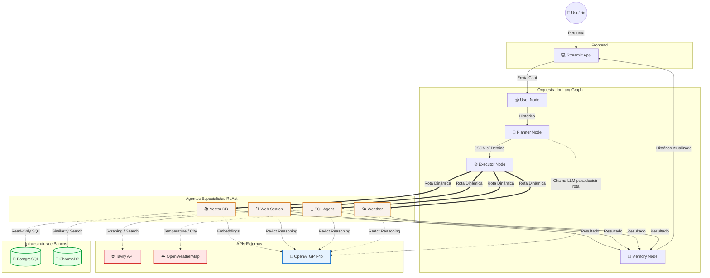

# Arquitetura do Sistema (Mermaid)

Este documento contém o diagrama visual da arquitetura do `Multi-Agent Conversational Assistant`, modelado com a linguagem Mermaid para renderização nativa no GitHub.

